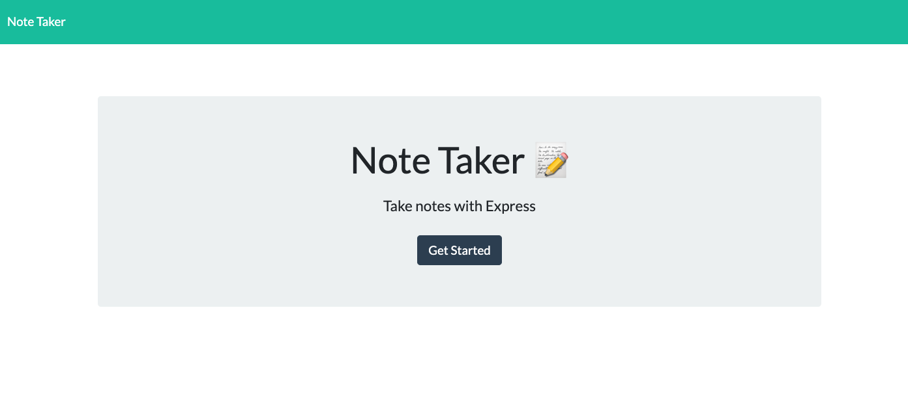
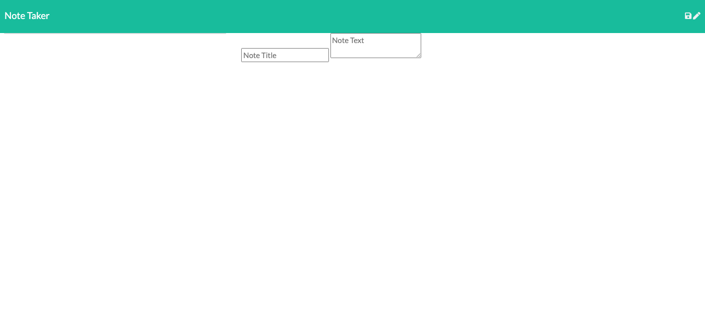

# Note-Taker
The purpose of this application is to have a centralized place for notes and note taking. Notes can be saved and deleted.

The acceptence criteria for this application is as follows:
Application should allow users to create and save notes.
Application should allow users to view previously saved notes.
Application should allow users to delete previously saved notes.

This project can be found at https://dlabins-note-taker.herokuapp.com/.

